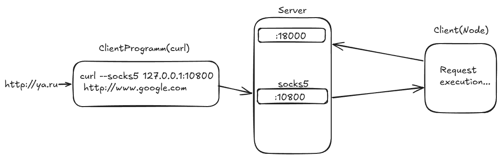

# CBA-Backproxy
Сервер запускается и на указанном TCP-порту слушает подключения от клиента.После этого запускается клиент и подключается к серверу , сразу после первого подключения клиента, сервер слушает ещё один socks5-порт . Далее мы можем отправлять запросы на этот порт и вот как они будут обрабатываться - вы отправляете запрос, сервер отправляет его клиенту , клиент выполняет этот запрос и результат отправляет обратно серверу , где уже сервер логирует результат. Вот как работает весь процесс схематично:



## Ключевыие особенности

#### 1) Распределение нагрузки

 - Если запросов больше, чем нод — сервер равномерно распределяет их между  доступными нодами.

#### 2) Каждый новый клиентский запрос получает свободную ноду.

 - Привязка клиента к ноде

 - После первого запроса клиентская программа фиксируется за конкретной нодой.

 - Все последующие запросы с того же IP-адреса обрабатываются только этой нодой.

#### 3) Механизм TTL (Time To Live)

- Каждому клиенту назначается TTL = 30 секунд.

- При получении нового запроса от того же адреса: TTL сбрасывается на 30 секунд.

- Если в течение 30 секунд запросы не поступают:Привязка клиента к ноде автоматически снимается.

- Следующий запрос будет обработан новой нодой (по алгоритму балансировки).

## 🔄 Динамическая маршрутизация запросов

| Аспект              | Реализация                                                                 |
|---------------------|---------------------------------------------------------------------------|
| **Балансировка**    | Равномерное распределение при превышении числа запросов над числом нод.   |
| **Привязка**        | Клиент фиксируется за нодой по IP после первого запроса.                  |
| **TTL (30s)**       | Сбрасывается при новых запросах. При бездействии — привязка снимается.    |


# Технологии и библиотеки
Сервер и клиент написаны на языке Go и использует следующие библиотеки и инструменты:  

### Язык программирования:
- Go (версия 1.23.8)

### Бибилоитеки

В проекте используются следующие ключевые библиотеки:

| Библиотека | Версия | Описание |
|------------|--------|----------|
| [github.com/google/uuid](https://github.com/google/uuid) | `v1.6.0` | Генерация уникальных UUID (Universally Unique Identifier) по стандарту RFC 4122.|
| [github.com/ilyakaznacheev/cleanenv](https://github.com/ilyakaznacheev/cleanenv) | `v1.5.0` | Загрузка конфигурации приложения из env-файлов и переменных окружения с валидацией. Поддерживает структуры Go.|
| [github.com/things-go/go-socks5](https://github.com/things-go/go-socks5) | `v0.0.5` | Реализация SOCKS5 прокси-сервера на Go. Позволяет создавать прокси-серверы с аутентификацией.  |
| [go.uber.org/zap](https://github.com/uber-go/zap) | `v1.27.0` | Высокопроизводительный логгер от Uber с структурированным выводом. |


## 📁 Структура проекта

```bash
.
├── cmd/                # Входные точки приложения
│   ├── client/         # Клиентская часть (main package)
│   └── server/         # Серверная часть (main package)
│
├── config/             # Конфигурационные файлы (YAML/ENV)
│
├── internal/           # Внутренние модули (закрытая логика)
│   ├── client/         # Клиентская логика
│   ├── server/         # Серверная логика
│   └── config/         # Загрузка и валидация конфигов
│
└── pkg/                # Переиспользуемые пакеты
    └── logger/         # Кастомный логгер (на базе Zap) 
```


# Quick start

Для начала нужно склонировать репозиторий командой

```bash
git clone https://github.com/VladimirGladky/CBA-Backproxy.git
```

Дальше переходите в папку с проектом:
```bash
cd CBA-Backproxy
```

Теперь вы можете запустить проект , но для этогт нужно чтобы был установлен Go версии 1.23.2 Ссылка для скачивания: [Go download](https://go.dev/doc/install)

После этого у вас есть 3 варианта запуска проекта:

### 1) Запуск файлов сервера и клиента:

Для этого сначала вам нужно зайти в папку config и поменять название файла на config.yaml , после этого установите переменные среды в этом файле как вы хотите на каком порту и хосту запускался сервер и на каком порту прослушивался socks5-прокси. Пример как установить уже есть в этом файле, но вот вам ещё один 

```bash
SERVER_HOST: "0.0.0.0"  # Хост для сервера
SERVER_PORT: "18000"    # Порт сервера
SOCKS5_PORT: "10800"    # Порт SOCKS5-прокси
```

Последнее , что нужно сделать перед запуском сервера и клиента - это воспользоваться командой:

```bash
go mod download
```

После этого вы можете запускать сервер и клиент, и вот как это сделать:

Запуск сервера:

```bash
go run ./cmd/server/server.go
```

У вас должно высветиться сообщение от логгера:
```bash
{"level":"info","ts":1743949882.310255,"caller":"logger/logger.go:17","msg":"Server started on port 18000"}
```

Потом вы открываете другой терминал и там выполняете вот эту команду:

```bash
go run ./cmd/client/client.go
```

У вас высветится:
```bash
{"level":"info","ts":1743949929.1466641,"caller":"logger/logger.go:17","msg":"Connected to server"}
{"level":"info","ts":1743949930.1477954,"caller":"logger/logger.go:17","msg":"Connected to server"}
{"level":"info","ts":1743949931.1517506,"caller":"logger/logger.go:17","msg":"Connected to server"} 
```

Я сразу подключаю три клиента к серверу , чтобы было больше обработчиков запросов , это можно убрать в коде закомментировав строки с 30 по 44 

А вот у сервера должно появиться вот это - информация о подключении 3 клиентов и о запуске socks5-сервера:
```
{"level":"info","ts":1743949929.1627429,"caller":"logger/logger.go:17","msg":"Accepted connection from client","id":"8f826431-1f80-4cbc-85b9-1ec0eb0f08ab"}
{"level":"info","ts":1743949929.536414,"caller":"logger/logger.go:17","msg":"Starting socks5 server"}
{"level":"info","ts":1743949930.174039,"caller":"logger/logger.go:17","msg":"Accepted connection from client","id":"fc503b69-ac29-41ee-99d7-f43611b15fa5"}
{"level":"info","ts":1743949931.1627812,"caller":"logger/logger.go:17","msg":"Accepted connection from client","id":"7b758395-5171-45d3-bade-312137fd4b06"}
``` 

### 2) Запуск с помощью makefile:

 - Установите сначала [choco](https://chocolatey.org/install)
 - Выполните команду 
 ```bash
 choco install make
 ```

Запуск сервера:

```bash
make server_build
make server_run
```

Запуск клиента:

```bash
make client_build
make client_run
```

Сообщения от логгера должны быть такие же , как и при первом варианте запуска.

Если хотите посмотреть всё что вы можете сделать с помощью make впишите в терминал команду
```bash 
make help
```

### 3) Запуск docker-compose:

- Установите [docker](https://docs.docker.com/get-started/get-docker/?_gl=1*2q6ppx*_gcl_au*MTA3MzM1MTc5Mi4xNzQzOTUzOTgx*_ga*MTU0NDM4OTY1Ni4xNzQzOTUzOTgy*_ga_XJWPQMJYHQ*MTc0Mzk1Mzk4MS4xLjEuMTc0Mzk1NDEyMC4yNi4wLjA.)


Выполните команду:

```bash
docker-compose up
```

Логи сервера и клиента должны быть такие же как и у двух предыдущих вариантов запуска.


## Примеры использования 
После того как вы воспользовались одним из трёх вариантов запуска , для того чтобы протестировать как работает.

Один из вариантов использовать git bash , отправляя вот такой запрос 

```bash 
curl --socks5 127.0.0.1:10800 http://ya.ru
```

и вот какой ответ вы получите на сервере:

```bash
{"level":"info","ts":1743960249.5331821,"caller":"logger/logger.go:17","msg":"Received request from client","address":"127.0.0.1"}
{"level":"info","ts":1743960249.7254486,"caller":"logger/logger.go:17","msg":"Received data from client","data":"<!doctype html><html prefix=\"og: http://ogp.me/ns#\" lang=\"ru\"><meta http-equiv=\"X-UA-Compatible\" content=\"IE=edge\"><meta charset=\"utf-8\"><meta name=\"viewport\" content=\"width=device-width,initial-scale=1\">\n    <link rel=\"icon\" href=\"https://yastatic.net/s3/home-static/_/a6/a6a296b741b51880ae8a9b04a67cfe3f.png\" sizes=\"16x16\">\n    <link rel=\"icon\" href=\"https://yastatic.net/s3/home-static/_/f4/f47b1b3d8194c36ce660324ab55a04fe.png\" sizes=\"32x32\">\n    <link rel=\"icon\" href=\"https://yastatic.net/s3/home-static/_/f0/f0597b6727cc67dceebc4e3a87caf571.png\" sizes=\"192x192\">\n    <link rel=\"apple-touch-icon\" href=\"https://yastatic.net/s3/home-static/_/a7/a79b81aa025e9edb2244e38581c868ad.png\" sizes=\"152x152\">\n    <link rel=\"apple-touch-icon\" href=\"https://yastatic.net/s3/home-static/_/46/462e92b9e3792be37a1c3fdefb26af28.png\" sizes=\"180x180\">\n<title data-react-helmet=\"true\">Вы не робот?</title><meta data-react-helmet=\"true\" property=\"og:title\" content=\"Яндекс\"><meta data-react-helmet=\"true\" property=\"og:descr"}
```

у клиента будет вот такая ифнормация:
```bash
{"level":"info","ts":1743960249.5331821,"caller":"logger/logger.go:17","msg":"Received request from server","address":"5.255.255.242:80"}
ya.ru
```


После истечения TTL появится вот такое сообщение:
```bash
{"level":"info","ts":1743960283.0863101,"caller":"logger/logger.go:17","msg":"Client moved back to free pool due to TTL","id":"48b12d74-ab7d-4446-92d4-e77207e65223"}
```


 


